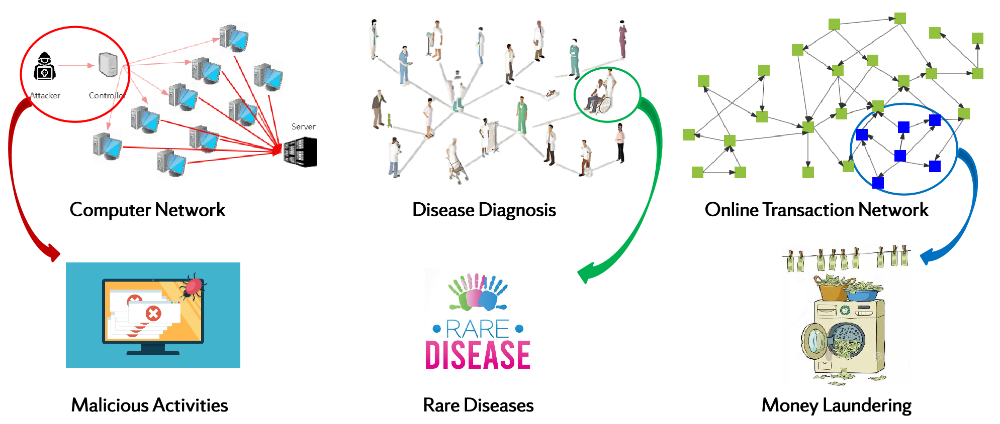
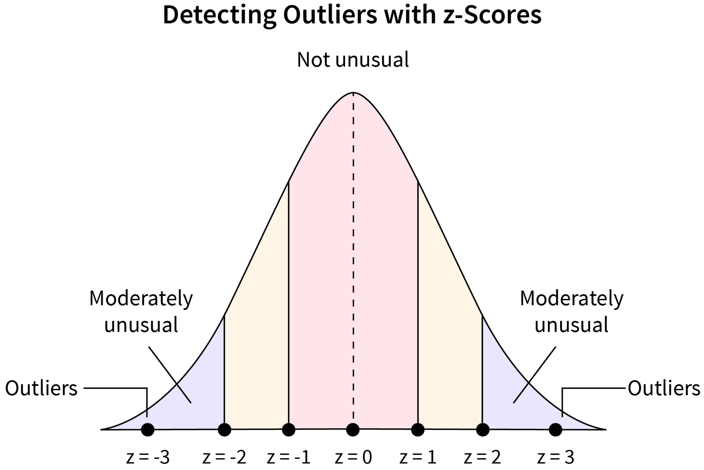
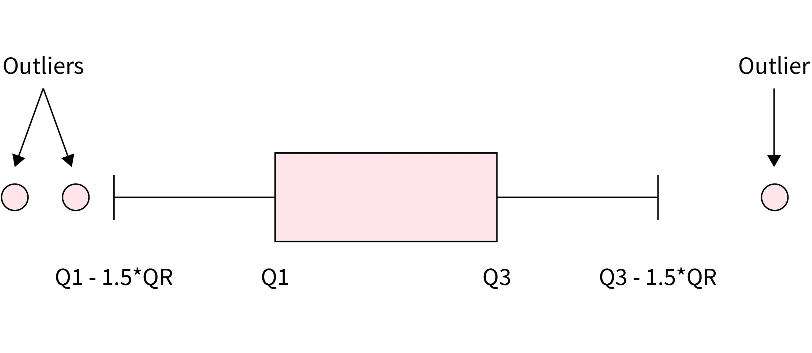
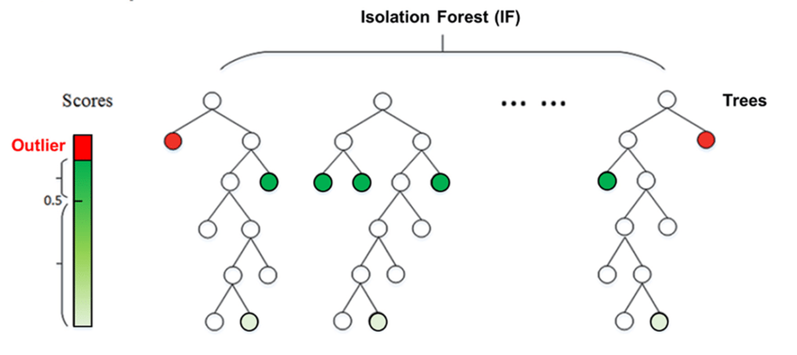

::: column-screen
{.content-header-full-img}
<p style="text-align:right; font-size:0.66em">
Image source: https://www.freepik.com
</p>
:::

## Introduction

Anomaly detection (AD), also known as outlier detection, refers to the process of identifying patterns, events, or observations in a given dataset that deviate significantly from the norm or expected behavior. In other words, it involves finding instances that are unusual, rare, or different from the majority of the data. These instances are often referred to as anomalies, outliers, or novelties.

The primary goal of anomaly detection is to distinguish normal patterns from abnormal ones, which can have various applications in different domains. By identifying anomalies, one can uncover potential issues, errors, fraud, or unusual events that may require further investigation or action.

This concept has various applications in real world acorss different domains. For example:

1.  Network Security: Anomaly detection is applied to network traffic to identify abnormal patterns that may suggest a cyber attack or unauthorized access. Unusual spikes in data transfer or irregular access patterns could be indicative of security breaches.

2.  Healthcare Monitoring: In healthcare, anomaly detection can be employed to identify unusual patterns in patient data, such as vital signs or laboratory results. This can help in early detection of diseases or abnormalities.

3.  Fraud Detection in Finance: Anomaly detection is commonly used in the financial sector to identify unusual patterns in transactions that may indicate fraudulent activities, such as credit card fraud or insider trading.

    ...\

{#fig-applications fig-align="center"}

Anomaly detection is a crucial aspect of data analysis in many fields, helping to improve security, reduce fraud, enhance system reliability, and provide early warnings for potential issues.

## Methods

### Categorization of AD Algorithms

Considering the significant importance of anomaly detection, lots of efforts has been made to improve the performance of anomaly detection. Several techniques could be employed for anomaly detection, and the choice of method often depends on the characterizations of dataset and the specific requirements of the application. Here are some common techniques that could be utilized for anomaly detection:

**Rule-Based Methods**: These methods rely on the domain-specific rules that are generated from domain experts' knowledge to define explicit rules or conditions to identify anomalies. In many domains, experts can define rules based on their understanding of the system or process. These rules may take the form of if-then statements that describe conditions under which a data point is considered anomalous. For example: If a financial transaction is significantly larger than typical transactions, consider it suspicious.

**Statistical Methods**: These methods can be boardly categorized into absolute socre-based methods and relative score-based methods. - Absolute score-based methods: In absolute score-based methods, the anomaly score is calculated based on the absolute value of a statistical measure. For example, in Z-Score, the distance of a data point from the mean is expressed in terms of standard deviations. High absolute Z-scores indicate points far from the mean, and these are considered anomalies. - Relative score-based methods: In relative score-based methods, the anomaly score is interpreted relative to the distribution of the data. Instead of using fixed absolute thresholds, percentage-based thresholds may be employed. For example, identifying the top 1% or 5% of data points as anomalies.

::: {#fig-statistical-methods layout-ncol="1"}
{#fig-Detecting-Outliers-with-z-Scores}

{#fig-Detecting-Outliers-with-IQR}

Statistical Methods for Outliers Detection. source: [https://www.scaler.com/](topics/data-science/handling-outliers-in-data-science/)
:::

**Clustering Methods**: Clustering methods involve grouping data points into clusters based on their similarity and then identifying anomalies as data points that do not conform to these clusters. Commonly used methods such as DBSCAN, K-Means etc. - DBSCAN is a density-based clustering algorithm that groups together data points that are close to each other and have a sufficient number of neighbors. Points that do not belong to any cluster or are in sparser regions of the data are considered anomalies (noise). - K-Means partitions the dataset into a predetermined number of clusters (k) based on the mean of data points in each cluster. Data points that do not fit well into any cluster or are far from the cluster centers may be considered anomalies.

**Machine Learning Methods**: Machine learning-based methods for anomaly detection involve training models to learn patterns in normal data and then identifying instances that deviate significantly from these learned patterns. For example, Isolation Forest is an ensemble method that works by isolating anomalies in a dataset. It does this by randomly selecting a feature and then creating a split between the minimum and maximum values of that feature. Anomalies are expected to be isolated with fewer splits.

**Deep Learning Methods**: Deep learning-based methods for anomaly detection leverage neural networks, particularly deep architectures, to model complex patterns and representations in data. For example, Autoencoders are neural networks trained to encode input data into a compressed representation and then decode it back to the original form. Anomalies are identified by measuring the difference between the input and the reconstructed output. Instances with high reconstruction errors are considered anomalies.

Experts often recommend considering the nature of the data and the specific goals of anomaly detection when choosing between these categories. There is no one-size-fits-all approach, and the choice may depend on factors such as the data distribution, the presence of outliers, and the desired trade-off between false positives and false negatives. Additionally, combining multiple methods or using hybrid approaches is common for improved robustness and accuracy in real-world applications.

### Typical AD Algorithms

As mentioned above, there are many anomaly detection algorithms available. In this post, we will choose two algorithms that are used more in sklearn for our anomaly detection experiments. They are described as follows:

#### Isolation Forest

The Isolation Forest algorithm is an unsupervised method for detecting anomalies by leveraging the characteristics of anomalies, specifically their scarcity and distinctiveness. Since anomalies are both infrequent and different from the majority of data points, they are more prone to isolation. This algorithm individually isolates each data point and categorizes them as outliers or inliers based on the time it takes to separate them. The separation process is influenced by the number of points within the proximity of a given point. If an attempt is made to isolate a point that is clearly not an outlier, it will likely be surrounded by many points, making isolation challenging. Conversely, if the point is indeed an outlier, it will be isolated easily as it tends to be solitary in the dataset. An illustration of the algorithm is listed below:

{#fig-if fig-align="center"}

#### Local Outlier Factor

The Local Outlier Factor (LOF) algorithm is an unsupervised approach for identifying anomalies by assessing the local density variation of a specific data point in relation to its neighboring points. This computation involves examining the density of a point's neighbors and contrasting it with the density of subsequent neighboring points. In essence, LOF identifies outliers by detecting instances where the density surrounding an object significantly differs from the density around its neighboring points. LOF labels samples as outliers if they exhibit notably lower density compared to their neighboring points.

### Evaluation Metrics

Anomaly detection can essentially be viewed as a binary classification task that distinguishes data points into two categories: normal and outliers. Therefore, common evaluation metrics in classification tasks can also be used for anomaly detection.

In this post, we will use the precision, recall and $F_1$ are as indicators for model performance evaluation.

According to wikipedia, the definition of these metrics as following :

Precision is the fraction of relevant instances among the retrieved instances. Written as a formula:

$$
{\displaystyle {\text{Precision}}={\frac {\text{Relevant retrieved instances}}{\text{All retrieved instances}}}}
$$

Recall is the fraction of relevant instances that were retrieved. Written as a formula:

$$
{\displaystyle {\text{Recall}}={\frac {\text{Relevant retrieved instances}}{\text{All relevant instances}}}}
$$

$F_1$ score is the harmonic mean of the precision and recall. Written as a formula:

$$
{\displaystyle F_{1}={\frac {2}{\mathrm {recall} ^{-1}+\mathrm {precision} ^{-1}}}=2{\frac {\mathrm {precision} \cdot \mathrm {recall} }{\mathrm {precision} +\mathrm {recall} }}={\frac {2\mathrm {tp} }{2\mathrm {tp} +\mathrm {fp} +\mathrm {fn} }}}
$$

where $tp$ is the true positives, $fp$ is the false positive, and $fn$ is the false negative.

## Dataset

In this section, we will load the libraries, analysis the dataset and get insights from the data distribution through data visualization. The procedures are listed below:

```{python}
import numpy as np 
import pandas as pd 
import matplotlib.pyplot as plt
import seaborn as sns
from sklearn.decomposition import PCA
```

### Load the Data

```{python}
#| tbl-column: page
nRowsRead = 1000
df = pd.read_csv('data/creditcard_10k.csv', delimiter=',', nrows = nRowsRead)
df
```

### Descriptive Statistics

```{python}
print('No Frauds', round(df['Class'].value_counts()[0]/len(df) * 100,2), '% of the dataset')
print('Frauds', round(df['Class'].value_counts()[1]/len(df) * 100,2), '% of the dataset')
```

```{python}
#| fig-align: center
fraud = len(df[df['Class'] == 1]) / len(df) * 100
nofraud = len(df[df['Class'] == 0]) / len(df) * 100
fraud_percentage = [nofraud, fraud]
fig = plt.figure()
plt.pie(fraud_percentage,labels = ['Fraud','No Fraud'], autopct='%1.1f%%', colors=['deepskyblue', 'tomato'])
fig.patch.set_facecolor('white')
fig.patch.set_alpha(0)
plt.title('Number of Fraud Cases');
plt.show()
```

### Data Distribution

As we can see from the outputs above, the dataset is highly unbalanced, the frauds data points only accounts for 0.2% which makes the anomaly detection challenge compare to most supervised learning.

```{python}
plt.style.use('default')
sns.pairplot(df[["Amount", "Time"]], aspect=1.5, height=2.6, kind="scatter", diag_kind="hist")
plt.rc('font', **{'size': 13})
plt.show()
```

The `Amount` are highly skewed, but the data points are almost equally distributed over the time. We then examine the relationship between the variables by plotting the correlation heatmap as below:

```{python}
#| fig-align: center
plt.style.use('default')
df_corr = df.corr()
plt.figure(figsize=(8.8,7))
sns.heatmap(df_corr, cmap="YlGnBu") 
sns.set(font_scale=2,style='white')

plt.rc('font', **{'size': 13})
plt.title('Heatmap correlation', fontsize=13)
plt.show()
```

### 3D Visualization

In order to get a better understanding of the dataset, we can use PCA to transform the data into 3 dimensions and mark the outliers in the 3D space.

```{python}
#| fig-align: center
from sklearn.decomposition import PCA
from sklearn.preprocessing import StandardScaler
from mpl_toolkits.mplot3d import Axes3D

num_df = df.columns[0:30]
outliers = df.loc[df['Class']==1]
outlier_index=list(outliers.index)

scaler = StandardScaler()
X = scaler.fit_transform(df[num_df])
pca_model = PCA(n_components=3)
X_pca = pca_model.fit_transform(X)
```

```{python}
#| label: fig-3d
#| fig-cap-location: top
#| fig-cap: Visualization of Outliers in 3D Space
plt.style.use('default')
fig = plt.figure(figsize=(10,6))
ax = fig.add_subplot(111, projection='3d')
ax.scatter(X_pca[:, 0], X_pca[:, 1], zs=X_pca[:, 2], s=3, lw=1, label="inliers",c="deepskyblue")
ax.scatter(X_pca[outlier_index,0],X_pca[outlier_index,1], X_pca[outlier_index,2], s=60, lw=2, marker="*", c="tomato", label="outliers")
ax.legend(loc=2, prop={'size': 8})
ax.zaxis.set_tick_params(labelsize=8)
plt.xticks(fontsize=8)
plt.yticks(fontsize=8)
plt.show()
```

## Experiments

### Preprocessing

We first load the libraries, and prepare the data for modeling.

```{python}
from sklearn.metrics import classification_report,accuracy_score, confusion_matrix
from sklearn.ensemble import IsolationForest
from sklearn.neighbors import LocalOutlierFactor
from sklearn.svm import OneClassSVM
from sklearn.metrics import confusion_matrix, ConfusionMatrixDisplay
```

```{python}
df = pd.read_csv('data/creditcard_10k.csv', delimiter=',', nrows = 10000)
columns = df.columns.tolist()
columns = [c for c in columns if c not in ["Class"]]
target = "Class"
state = np.random.RandomState(666)
X = df[columns]
Y = df[target]
print(X.shape)
print(Y.shape)
```

```{python}
Fraud = df[df['Class']==1]
Valid = df[df['Class']==0]
outlier_ratio = len(Fraud)/float(len(Valid))
print(f"Fraud: {len(Fraud)}, Valid: {len(Valid)}, ratio:{outlier_ratio}")
```

### Training

We can now define the models. We are going to use `OneClassSVM` as the baseline, and focus on `IsolationForest` and `LocalOutlierFactor` for anomaly detection.

```{python}
classifiers = {
    "Isolation Forest": IsolationForest(
        n_estimators=100, 
        max_samples=len(X),
        contamination=outlier_ratio,
        random_state=666,
        verbose=0
    ),
    "Local Outlier Factor": LocalOutlierFactor(
        n_neighbors=50, 
        algorithm='auto', 
        leaf_size=50, metric='minkowski',
        p=2,
        metric_params=None,
        contamination=outlier_ratio
    ),
    "Support Vector Machine": OneClassSVM(
        kernel='rbf', 
        degree=5, 
        gamma=0.1,nu=0.05,
        max_iter=-1
    )
}
```

Training begins ...

```{python}
def fit_predict(classifier_name):
    n_outliers = len(Fraud)
    classifier = classifiers[classifier_name]
    if classifier_name == "Local Outlier Factor":
        y_pred = classifier.fit_predict(X)
        scores_prediction = classifier.negative_outlier_factor_
    elif classifier_name == "Support Vector Machine":
        classifier.fit(X)
        y_pred = classifier.predict(X)
    else:    
        classifier.fit(X)
        scores_prediction = classifier.decision_function(X)
        y_pred = classifier.predict(X)
    # 0 for Valid, 1 for Fraud
    y_pred[y_pred == 1] = 0
    y_pred[y_pred == -1] = 1
    n_errors = (y_pred != Y).sum()
    print(f"{classifier_name}: {n_errors} prediction errors")
    return y_pred
```

```{python}
y_pred_if = fit_predict("Isolation Forest")
y_pred_lof = fit_predict("Local Outlier Factor")
y_pred_svm = fit_predict("Support Vector Machine")
```

Training completed! At first glance, SVM performs very bad, it has 5528 prediction errors which means the accuracy is less than 50%. The `Isolation Forest` and `Local Outlier Factor` are looks good, with accuracy more than 99%. However, the accuracy is not enough for assessment, because in some application, it is very costly to miss any outlier but it can tolerance to classify a normal data point as outlier. However, in other cases it might be very expensive to treat a normal data point as outlier, but wouldn't be a big problem to miss a outlier.

### Performance Evaluation

In this section, we will evaluate the model performance with the precision, recall and $F_1$ score, as long as a visualization of the confusion matrix.

```{python}
def evaluate(y_pred):
    #print("Accuracy Score:")
    #print(accuracy_score(Y,y_pred))
    #print("Classification Report:")
    print(classification_report(Y,y_pred))
    
def display_confusion_matrix(y_pred):
    plt.style.use('default')
    cm = confusion_matrix(Y,y_pred)
    disp = ConfusionMatrixDisplay(confusion_matrix=cm)
    fig, ax = plt.subplots(figsize=(1.1,1.1))
    return disp.plot(ax=ax)
```

```{python}
#| warning: false
#| fig-align: center
evaluate(y_pred_lof)
disp = display_confusion_matrix(y_pred_lof)
plt.show()
```

```{python}
#| warning: false
#| fig-align: center
evaluate(y_pred_if)
disp = display_confusion_matrix(y_pred_if)
plt.show()
```

```{python}
#| warning: false
#| fig-align: center
#| tbl-column: body
evaluate(y_pred_svm)
disp = display_confusion_matrix(y_pred_svm)
plt.show()
```

In our dataset, there are 38 frauds in total. From the performance report and confusion matrix, we can infer that: `local outlier factor` only detects 1 fraud data point, while `isolation forest` predicts 12 frauds successfully. In this sense, `isolation forest` has much better performance.

## Discussion and Conclusion

In this post, we introduced the anomaly detection and its application across different domains, then we discussed the categorization of AD Algorithms, followed by a detailed explaination of `isolation forest` and `local outlier factor`. After some exploratory data analysis and data preprocessing, we trained machine learning models to detect the outliers. Our performance evaluation shows that `isolation forest` has the best performance.

As expected, the `OneClassSVM` doesn't perform well for outlier detection, as it is very sensitive to outliers. This algorithm is best suited for applications where the training set is not contaminated by outliers.

The `isolation forest` and `local outlier factor` are much better than `OneClassSVM`, and performs reasonably well. However, the `isolation forest` has slightly better performance and it also runs faster than `local outlier factor` in our experiments.

In summary, when choosing between `isolation forest` and Local `local outlier factor`, you should consider the nature of your data, the types of outliers you expect, and the computational resources available. It's often beneficial to experiment with both algorithms on your specific dataset and assess their performance using appropriate evaluation metrics. Ensemble approaches that combine the strengths of both methods may also be considered for more robust outlier detection.
